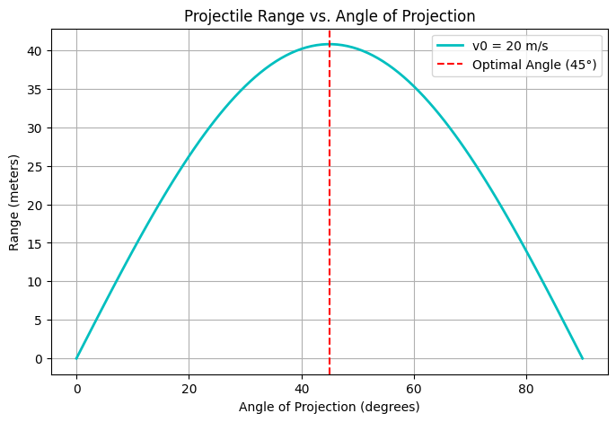
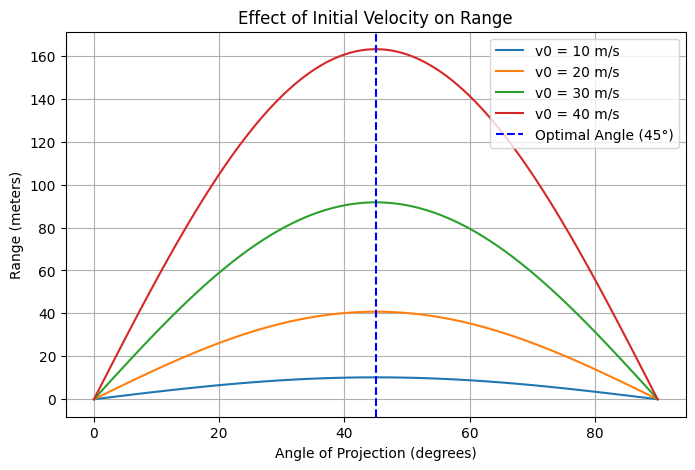
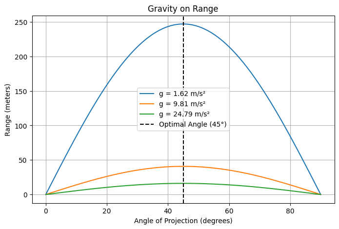
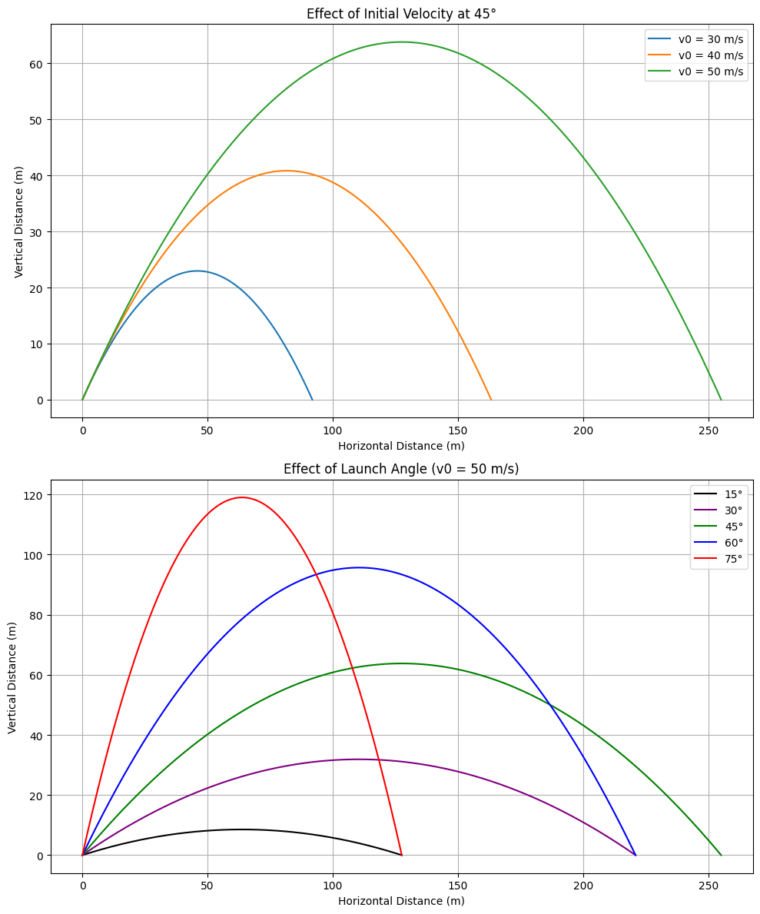

# Problem 1

## Theoretical Foundation of Projectile Motion

### **Step 1: Deriving the Governing Equations**
Projectile motion is based on Newton’s Second Law:

$$
\vec{F} = m\vec{a}
$$

In the case of a projectile undergoing freefall and assuming no air resistance, the only acting force is gravity, directed downward:

$$
F_y = -mg, \quad F_x = 0
$$

This leads to the following equations of motion:

$$
m \frac{d^2 x}{dt^2} = 0
$$

$$
m \frac{d^2 y}{dt^2} = -mg
$$

Dividing both sides by $m$ and integrating twice:

#### **1. Horizontal Motion**
- $\frac{d^2x}{dt^2} = 0$ ⟶ First integration ⟶ $\frac{dx}{dt} = v_{0x}$ (a constant)
- Second integration ⟶ $x = v_{0x} t + x_0$

Since $v_{0x} = v_0 \cos\theta$, we get:

$$
x = v_0 \cos\theta \cdot t
$$

#### **2. Vertical Motion**
- $\frac{d^2y}{dt^2} = -g$ ⟶ First integration ⟶ $\frac{dy}{dt} = -gt + v_{0y}$
- Second integration ⟶ $y = -\frac{1}{2}gt^2 + v_{0y} t + y_0$

Using $v_{0y} = v_0 \sin\theta$, we obtain:

$$
y = -\frac{1}{2}gt^2 + v_0 \sin\theta \cdot t + y_0
$$

### **Step 2: Variety of Solutions Based on Initial Conditions**
Projectile motion is influenced by key initial parameters:
- **Initial speed ($v_0$)**: Affects the overall distance and maximum height.
- **Launch angle ($\theta$)**: Determines range, with a peak at $\theta = 45^\circ$ due to $\sin 2\theta$ dependence.
- **Initial height ($y_0$)**: Impacts the total flight time and final distance traveled.

Adjusting these conditions leads to various trajectories — a reflection of how simple physics laws produce diverse outcomes.

## Real-World Uses of Projectile Motion

### 1. **Uneven Terrain**
When launch and landing heights differ, the vertical position is:

$$y = y_0 + v_0 \sin\theta \cdot t - \frac{1}{2} g t^2$$

To determine range, solve for $t$ when $y = 0$, which typically involves solving a quadratic equation.

### 2. **Air Drag**
Air resistance causes deviations from ideal parabolic motion. The drag force is defined as:

$$\vec{F}_d = - \frac{1}{2} C_d \rho A v^2 \hat{v}$$

This leads to complex, non-linear differential equations that are often handled with numerical techniques.

### 3. **Wind and Variable Conditions**
Factors like wind or non-uniform gravity influence the launch parameters. For instance, wind modifies both horizontal and vertical components of motion.

### 4. **Application Examples**
- **Sports**: Air drag alters how balls move in soccer or basketball.
- **Military**: Projectile and missile paths are calculated considering resistance and gravity.
- **Aerospace**: Spaceflight must take varying gravity and drag into account.
- **Engineering**: Trajectories in controlled demolitions require detailed predictions.

### 5. **Computational Approaches**
In scenarios with drag or non-constant gravity, numerical methods such as Euler’s or Runge-Kutta techniques approximate the motion effectively.

## Analysis of the Range

## Horizontal Range and Angle of Projection

The *horizontal range* $R$ is the total distance a projectile travels horizontally before returning to the original height ($y = y_0$).

Assuming $y_0 = 0$, the total flight time $T$ is:

$$
T = \frac{2 v_0 \sin \theta}{g}
$$

Thus, the range is:

$$
R = v_0 \cos \theta \cdot T = v_0 \cos \theta \cdot \frac{2 v_0 \sin \theta}{g}
$$

Simplified:

$$
R = \frac{v_0^2 \sin(2\theta)}{g}
$$

The outcome depends heavily on the launch angle:

- Maximum range occurs when $\sin(2\theta) = 1$, i.e., at $\theta = 45^\circ$.
- The function $\sin(2\theta)$ is symmetric around 45°, so:
  - $R(30^\circ) = R(60^\circ)$
  - $R(10^\circ) = R(80^\circ)$

---

## Role of Other Parameters

### 1. Initial Speed $v_0$

From the range formula:

$$
R = \frac{v_0^2 \sin(2\theta)}{g}
$$

- The range increases *quadratically* with $v_0$.
- Doubling $v_0$ multiplies the range by four.
- More speed results in longer airtime and faster movement.

### 2. Gravitational Acceleration $g$

- Range is *inversely related* to $g$.
- On the Moon (with lower $g$), projectiles travel significantly farther.
- Example:
  - Earth: $g \approx 9.8\, \text{m/s}^2$
  - Moon: $g \approx 1.6\, \text{m/s}^2 \Rightarrow R_{\text{moon}} \approx 6.1 \times R_{\text{earth}}$

---

## Summary

- Range is influenced by launch angle via the $\sin(2\theta)$ term.
- It peaks at 45° and is symmetric around that angle.
- Greater *initial velocity* boosts the range significantly.
- Weaker *gravity* enables longer travel distances.

Understanding these principles enables optimization of projectile paths — useful in fields ranging from athletics to orbital mechanics.

#### Plot showing how the range varies with the angle of projection.

#### Analysis of the Graphs

### **Graph (a)**
- This graph shows trajectories for different initial speeds (30 m/s, 40 m/s, 50 m/s) at an angle of **45°**.
- Observations:
  - **Greater speed yields higher peak height and longer range.**

### **Graph (b)**
- This graph presents motion for various launch angles (15°, 30°, 45°, 60°, 75°) at a fixed speed of **50 m/s**.
- Key points:
  - **45° yields the greatest range**.
  - Other angles lead to shorter horizontal travel despite the same speed.

---

## 45° Results in Maximum Range

Range is determined by:

$$
R = \frac{v_0^2 \sin(2\theta)}{g}
$$

### Key Takeaways:
1. **Sine Function Impact**:
   - Since $\sin(2\theta)$ maxes out at 1 (when $2\theta = 90^\circ$), the optimal angle is $\theta = 45^\circ$.

2. **Symmetry**:
   - $\sin(2\theta)$ has symmetry about 45°, so:
     - $R(30^\circ) = R(60^\circ)$
     - $R(15^\circ) = R(75^\circ)$

### Practical Use:
The 45° launch angle is ideal for maximizing horizontal distance — explaining its strategic use in sports (e.g., javelin throwing) and military ballistics.

---

#### Effect of Initial Velocity on Range: Increasing velocity significantly boosts the range due to the square dependence

#### Effect of Gravity on Range: Lower gravity environments enable longer distances, while stronger gravity shortens them

[My Colab](https://colab.research.google.com/drive/1meVa4feifkyxvnlKQ2V4fAX1X01SJP99?usp=sharing)
