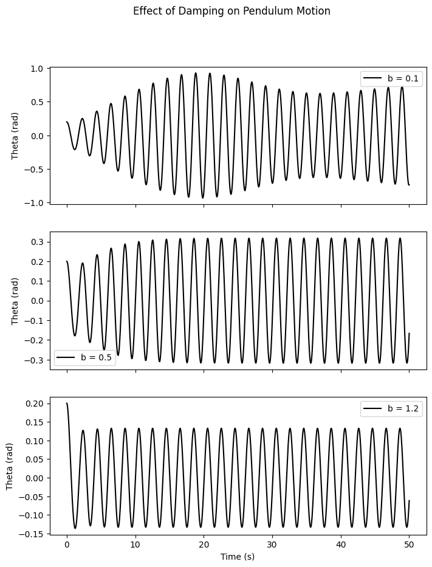
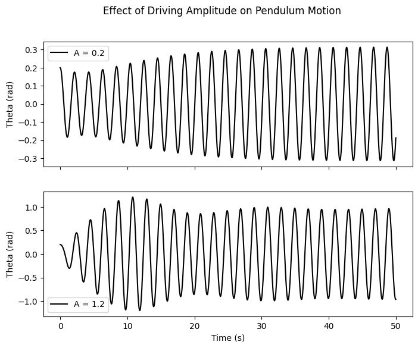
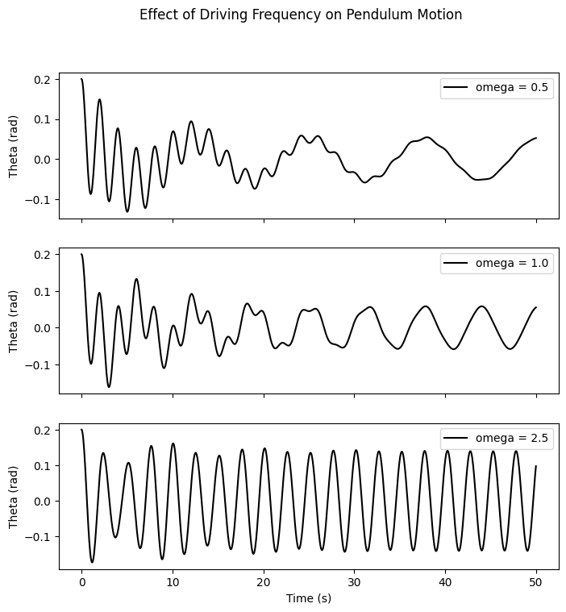
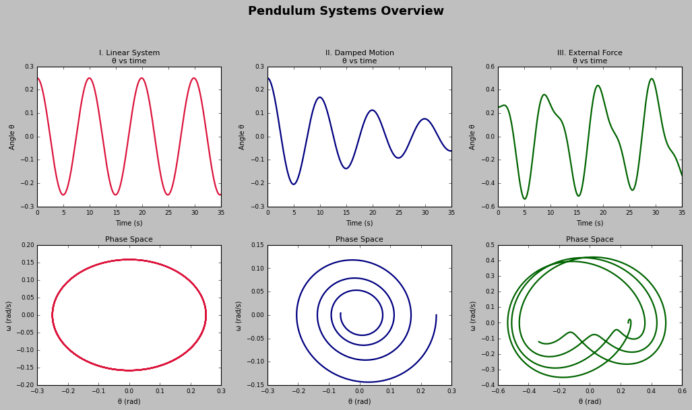
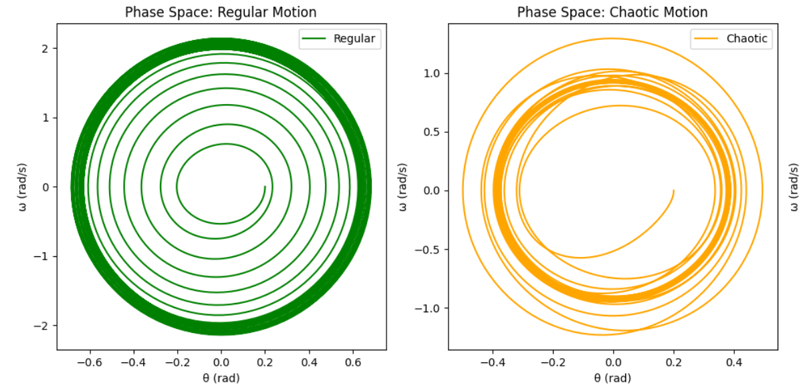
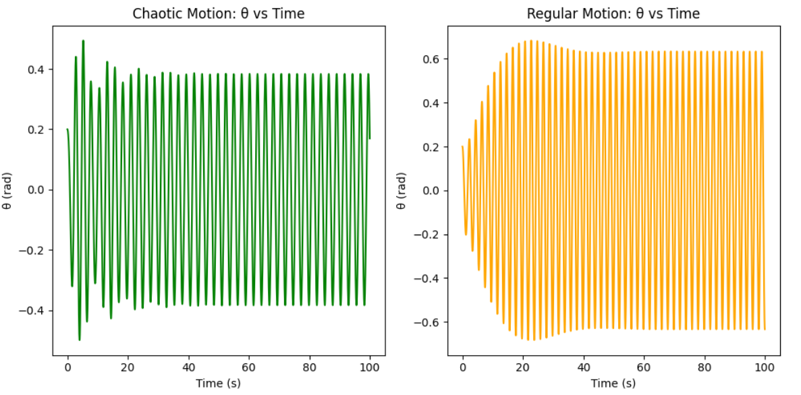

# Problem 2

## I. Governing Differential Equation of a Forced Damped Pendulum

The motion of a pendulum under the influence of damping and an external driving force is described by the nonlinear second-order differential equation:

$$
\frac{d^2\theta}{dt^2} + b \frac{d\theta}{dt} + \frac{g}{L} \sin\theta = A \cos(\omega t)
$$

Here:
- $\theta(t)$ is the angular position as a function of time,
- $b$ is the damping constant,
- $g$ is gravitational acceleration,
- $L$ is the pendulum length,
- $A$ represents the amplitude of the external periodic force,
- $\omega$ denotes the angular frequency of the driving force.

This equation is nonlinear due to the $\sin\theta$ term.

---

## II. Linear Approximation: Small-Angle Solution

For small oscillations where $\theta$ is small (in radians), we apply the approximation:

$$
\sin\theta \approx \theta
$$

This linearizes the equation:

$$
\frac{d^2\theta}{dt^2} + b \frac{d\theta}{dt} + \frac{g}{L} \theta = A \cos(\omega t)
$$

This is mathematically equivalent to a forced, damped harmonic oscillator:

$$
\ddot{\theta} + 2\beta \dot{\theta} + \omega_0^2 \theta = A \cos(\omega t)
$$

where:
- $\omega_0 = \sqrt{\frac{g}{L}}$ is the undamped natural frequency,
- $2\beta = b$ denotes the damping rate.

### Steady-State Particular Solution

The long-term solution of this system is:

$$
\theta_p(t) = \theta_0 \cos(\omega t - \delta)
$$

with:

$$
\theta_0 = \frac{A}{\sqrt{(\omega_0^2 - \omega^2)^2 + 4\beta^2 \omega^2}}, \quad \tan\delta = \frac{2\beta \omega}{\omega_0^2 - \omega^2}
$$

This illustrates how both amplitude and phase lag are influenced by the driving frequency and damping.

---

## III. Resonance Behavior and Energy Aspects

### Resonant Response

Resonance manifests when the driving frequency nears the natural frequency:

$$
\omega \approx \omega_0
$$

However, damping causes a shift, and the maximum amplitude is observed at:

$$
\omega_{\text{res}} = \sqrt{\omega_0^2 - 2\beta^2}
$$

### Energy Dynamics

- At resonance, energy input from the driver is maximally efficient.
- Low damping may lead to energy accumulation, possibly damaging mechanical systems.
- High damping reduces energy build-up, controlling oscillation amplitudes.

---

## IV. Impact of System Parameters

### **Damping Factor ($b$)**
- **Large $b$**: Overdamped; slow return to equilibrium, no oscillations.
- **Moderate $b$**: Damped oscillations that decay gradually.
- **Small $b$**: Persistent oscillations; greater potential for resonance or chaos.

### **External Force Amplitude ($A$)**
- **Low values**: Predictable, nearly harmonic motion.
- **Medium values**: System begins to display nonlinear effects.
- **High values**: Can result in chaotic motion and sensitivity to initial conditions.

### **Driving Frequency ($\omega$)**
- **Low $\omega$**: The system closely follows the driver.
- **Near $\omega_0$**: System exhibits peak amplitude (resonance).
- **High $\omega$**: Oscillations become irregular or unstable.

---

## V. From Predictability to Chaos

### **Phase Space Visualization**
- **Orderly motion** → smooth loops (limit cycles).
- **Chaotic regime** → irregular, non-repeating trajectories.

### **Bifurcations and Chaos Onset**
- System transitions via **period doubling** and **bifurcations** as $A$ increases.
- Eventually leads to a chaotic state characterized by unpredictable long-term behavior.

### **Lyapunov Exponent**
- Positive Lyapunov exponents signify chaotic dynamics due to extreme sensitivity to initial conditions.

---

## VI. Real-World Relevance

### **Energy Scavenging Systems**
- Pendulum-like devices in piezoelectric setups can convert vibrations into electricity.

### **Structural Engineering**
- Structures such as bridges are analyzed using this model to prevent oscillation-induced collapses.

### **Electrical Analogues**
- The damped driven pendulum has direct parallels in RLC electrical circuits used in communications and signal processing.

---

## VII. Visual Analysis of Parameter Effects

### 1. Varying Damping Coefficient

As damping increases, the pendulum's amplitude diminishes and oscillations decay faster.

### 2. Changing Driving Amplitude

Larger $A$ values amplify motion and introduce nonlinear effects.

### 3. Adjusting Driving Frequency

At resonance, oscillations peak; at high frequencies, they become erratic.

---

## VIII. Comparing Pendulum Variants

A comparison of simple, damped, and driven pendulums using time evolution and phase portraits:

## IX. Visualizing Dynamics: From Order to Chaos

### Phase Space and Time Evolution

- **Phase Space**: Ordered motion → regular loops; chaotic → scattered structures.

](image-8.png)
- **Time Series**: Predictable sinusoid in regular motion vs irregular fluctuations in chaos.

[My Colab](https://colab.research.google.com/drive/1n0DdQICtk8b00k0kCQ4dHr1McScM5Ezg?usp=sharing)
