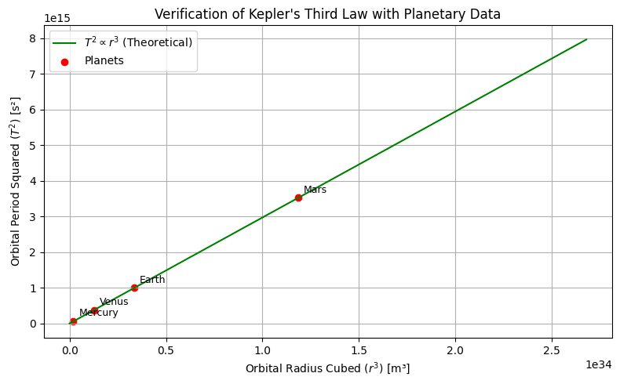

# Problem 1

# Exploring Kepler's Third Law

## Derivation of the Law for Orbital Motion

### Step 1: Forces Governing Orbital Motion

Newton’s Universal Law of Gravitation:

$$
F_g = \frac{G M m}{r^2}
$$

Centripetal force required for circular motion:

$$
F_c = m \frac{v^2}{r}
$$

Setting $F_g = F_c$ yields:

$$
\frac{G M m}{r^2} = m \frac{v^2}{r}
$$

Eliminating $m$:

$$
\frac{G M}{r^2} = \frac{v^2}{r}
$$

Multiplying through by $r$:

$$
v^2 = \frac{G M}{r}
$$

### Step 2: Introducing Orbital Period

Using the relationship $v = \frac{2\pi r}{T}$:

$$
\left(\frac{2\pi r}{T}\right)^2 = \frac{G M}{r}
$$

Rewriting:

$$
\frac{4\pi^2 r^2}{T^2} = \frac{G M}{r}
$$

Multiplying by $r$:

$$
4\pi^2 r^3 = G M T^2
$$

### Step 3: Key Relationship

Rearranging gives:

$$
T^2 = \frac{4\pi^2}{G M} r^3
$$

Thus:

$$
T^2 \propto r^3
$$

## Applications of Kepler’s Law in Astronomy

Kepler’s Third Law ($T^2 \propto r^3$) is foundational in celestial mechanics.

### 1. Determining Masses of Celestial Bodies
Using $M = \frac{4\pi^2 r^3}{G T^2}$, we can calculate the mass of central objects (like stars, planets, or moons) based on orbital observations.

### 2. Calculating Distances
The law allows astronomers to determine distances in planetary systems when orbital periods are known.

### 3. Exoplanet Studies
Kepler’s insights help scientists deduce the orbits and masses of exoplanets using observational data.

### 4. Gravitational Stability and Dark Matter
Deviations from $T^2 \propto r^3$ in galaxies suggest unseen influences like dark matter or additional gravitational sources.

### Conclusion
Kepler’s Third Law bridges orbital motion and gravitational dynamics, making it an essential tool for modern astronomy.

## Practical Examples of Kepler’s Third Law

### 1. Earth's Moon
- **Period:** 27.3 days
- **Distance:** ~384,400 km  
- **Usage:**  
By applying $M = \frac{4\pi^2 r^3}{G T^2}$, Earth's mass can be computed. Observations align well with other estimates, showcasing the law's reliability.

### 2. Solar System Planets
- **Proportionality:**  
  Orbital period $T$ and distance $r$ follow the relation $T^2 \propto r^3$.
- **Examples:**  
  - Earth: 1 year at 1 AU  
  - Mars: ~1.88 years at ~1.52 AU  

### Conclusion
Kepler’s law is validated through observations across our Solar System, aiding calculations of planetary masses and trajectories.

## Extensions to Elliptical Orbits

For elliptical orbits, the square of the orbital period remains proportional to the cube of the semi-major axis $a$:

$$
T^2 \propto a^3
$$

### Applications
- **Moons and Planets:**  
  Used for satellites, moons, and exoplanets orbiting their primary bodies.  
- **Binary Star Systems:**  
  Allows estimation of combined masses in stellar pairs.  
- **Complex Systems:**  
  Multi-body interactions require additional considerations but can still adhere to Kepler’s principles.

### Relativistic Effects
Near massive objects (e.g., black holes), modifications from General Relativity adjust predictions from Kepler’s Third Law.

### Conclusion
The law remains versatile across various orbital configurations, reaffirming its universality.

## Simulation Verification of Kepler’s Law

## General Observations

Kepler's Third Law links orbital periods to the masses and distances in celestial systems. It reveals that larger central masses correspond to shorter orbital periods for the same distance. A logarithmic graph illustrates how varying the mass of the central body impacts the relationship between radius and period. This law remains a cornerstone for astronomical studies and the characterization of planetary systems.

[Colab Notebook for Simulation](https://colab.research.google.com/drive/1epf4R5hQX6hPT-HhrGcgc2JgZOW6EpdO?usp=sharing)
