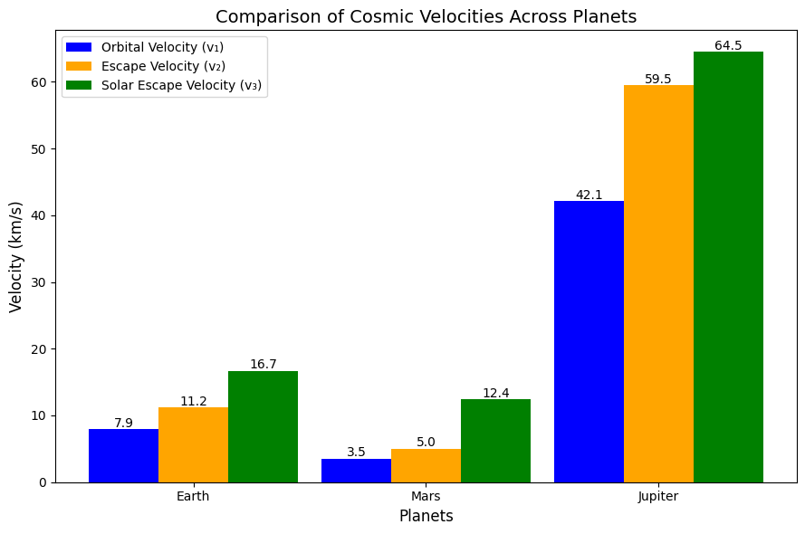

# Problem 2

## Understanding Cosmic Velocities: Orbital, Escape, and Solar System Exit

The concept of velocities required for orbital and interplanetary maneuvers is fundamental in space science. These velocities—referred to as the first, second, and third cosmic velocities—govern the energy thresholds for orbiting planets, escaping celestial bodies, and departing from star systems.

---

## 1. First Cosmic Velocity: *Orbital Speed*

### **Explanation**:
The **first cosmic velocity** refers to the **lowest speed** necessary for an object to maintain a **circular orbit** around a planet or similar celestial body **without propulsion assistance**.

### **Physical Insight**:
- Achieving this speed means the object continuously "falls" towards the planet but never reaches the surface, forming a stable orbit.
- The velocity depends on the gravitational pull and the planet's radius but is independent of the object's mass.

### **On Earth**:
- **Typical Speed**: Approximately **7.9 km/s** $~28,400 km/h$
- **Orbit Level**: Near-Earth orbits, such as Low Earth Orbit $LEO$
- **Examples**: Satellites like GPS systems and the ISS

---

## 2. Second Cosmic Velocity: *Escape Speed*

### **Definition**:
The **second cosmic velocity** is the **minimum speed** an object must reach to **break free from a planet's gravitational pull** without requiring further propulsion.

### **Key Features**:
- The object’s kinetic energy at this velocity equals its gravitational potential energy.
- Once achieved, the object will travel infinitely far from the planet, assuming no other forces act upon it.

### **For Earth**:
- **Typical Speed**: About **11.2 km/s** $~40,320 km/h$
- **Use Cases**: Lunar exploration, interplanetary missions

---

## 3. Third Cosmic Velocity: *Interstellar Escape Speed*

### **Explanation**:
The **third cosmic velocity** is the **minimum velocity** required to **leave the gravitational field of the Sun** entirely, starting from Earth's orbit.

### **Insights**:
- A spacecraft must first escape Earth’s gravity, then attain enough velocity relative to the Sun to overcome its gravitational influence.
- This velocity accounts for Earth’s orbital motion around the Sun.

### **From Earth's Orbit**:
- **Typical Speed**: Around **16.7 km/s** $~60,120 km/h$
- **Applications**: Interstellar probes like Voyager and New Horizons

---

## Summary of Cosmic Velocities

| Velocity Type       | Purpose                              | Approximate Speed $Earth$ | Example Missions                  |
|---------------------|--------------------------------------|---------------------------|------------------------------------|
| First Cosmic        | Stable orbit around the planet       | ~7.9 km/s                 | ISS, weather satellites           |
| Second Cosmic       | Escape from Earth's gravity          | ~11.2 km/s                | Apollo missions, Mars missions    |
| Third Cosmic        | Escape from the Solar System         | ~16.7 km/s                | Voyager, Pioneer probes           |

---

# Derivations of Cosmic Velocities

## 1. Orbital Velocity First Cosmic Velocity

### Formula:
$$
v_{1} = \sqrt{\frac{GM}{R}}
$$

Where:
- $v_{1}$: First cosmic velocity
- $G$: Gravitational constant $$6.674 \times 10^{-11} \ \text{m}^3/\text{kg} \cdot \text{s}^2$$
- $M$: Mass of the planet
- $R$: Distance from the planet’s center to the object

### Derivation:
Equating gravitational and centripetal forces:
$$
\frac{mv^2}{R} = \frac{GMm}{R^2} \Rightarrow v = \sqrt{\frac{GM}{R}}
$$

---

## 2. Escape Velocity Second Cosmic Velocity

### Formula:
$$
v_{2} = \sqrt{\frac{2GM}{R}}
$$

### Derivation:
Using conservation of energy principles:
$$
\frac{1}{2}mv^2 = \frac{GMm}{R} \Rightarrow v = \sqrt{\frac{2GM}{R}}
$$

Relation between first and second velocities:
$$
v_{2} = \sqrt{2} \cdot v_{1}
$$

---

## 3. Solar Escape Velocity Third Cosmic Velocity

### Formula:
$$
v_{3} = \sqrt{\frac{2GM_{\odot}}{r}} - v_{\text{Earth orbit}}
$$

Where:
- $M_{\odot}$: Solar mass
- $r$: Distance from the Sun
- $v_{\text{Earth orbit}}$: Earth’s orbital velocity $~29.78 km/s$

### Derivation:
The total energy for solar escape must equal zero:
$$
E = \frac{1}{2}v^2 - \frac{GM_{\odot}}{r} \geq 0 \Rightarrow v = \sqrt{\frac{2GM_{\odot}}{r}}
$$
Subtract Earth’s orbital speed:
$$
v_{3} = \sqrt{\frac{2GM_{\odot}}{r}} - v_{\text{Earth orbit}}
$$

---
## Bar chart

---

# Practical Applications

## 1. **Satellite Operations**

- **Purpose**: Achieving the first cosmic velocity ensures satellites can remain in stable orbits, vital for communication, weather monitoring, and navigation.
- **Example**: GPS satellites operate at speeds near Earth’s orbital velocity.

## 2. **Planetary Missions**

- **Purpose**: Escape velocity is essential for missions leaving Earth to explore other celestial bodies.
- **Example**: Mars rover launches required exceeding Earth’s second cosmic velocity.

## 3. **Deep Space Probes**

- **Purpose**: Achieving the third cosmic velocity allows spacecraft to exit the solar system and explore interstellar space.
- **Example**: Voyager 1, traveling at speeds sufficient to leave the Sun’s gravitational influence.

---

# Velocity Calculations for Different Planets

| Planet  | Mass $$M$$         | Radius $$R$$     | $v_{1}$ $km/s$ | $v_{2}$ $km/s$ |
|---------|--------------------|------------------|----------------|----------------|
| Earth   | $5.972 \times 10^{24}$ kg | $6.371 \times 10^6$ m | ~7.9           | ~11.2          |
| Mars    | $6.417 \times 10^{23}$ kg | $3.390 \times 10^6$ m | ~3.5           | ~5.0           |
| Jupiter | $1.898 \times 10^{27}$ kg | $6.9911 \times 10^7$ m| ~42.1          | ~59.5          |

[My Colab](https://colab.research.google.com/drive/1VIxLSbYEkVdqeCH5yTnKeRUhFM8QXqGx?usp=sharing)