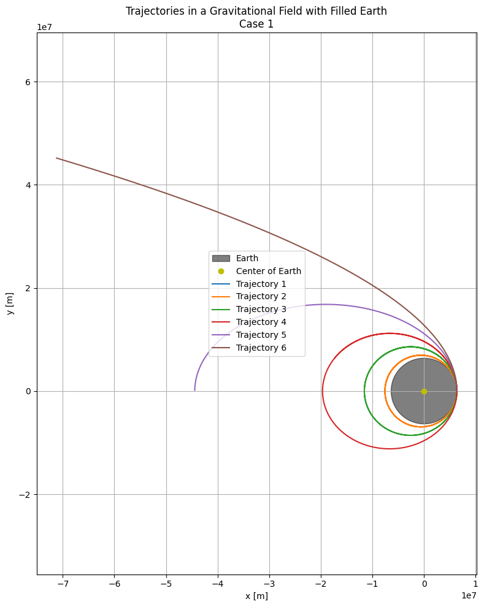
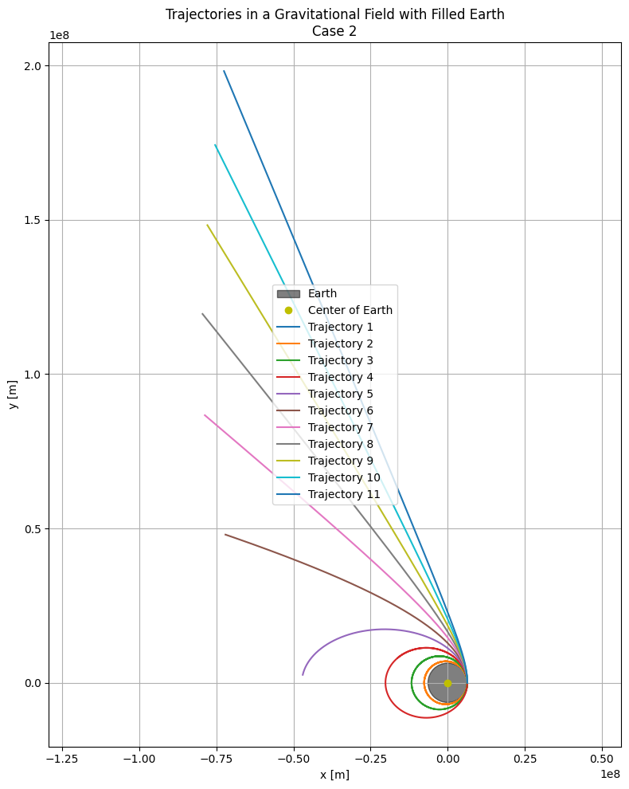

# Problem 3

# Motion of a Released Payload Near Earth's Surface

When a payload is detached from a moving spacecraft close to Earth, its trajectory depends on its **initial speed** and the **gravitational influence of Earth**. The resulting path falls under the category of **conic sections**, shaped by the **total mechanical energy** of the payload.

---

## Orbital Trajectories Classification

| Path Type       | Energy Criterion                     | Explanation                                |
|-----------------|--------------------------------------|--------------------------------------------|
| **Elliptical**  | $E < 0$                              | Bound orbit — remains within Earth’s vicinity. |
| **Parabolic**   | $E = 0$                              | Marginal escape path.                      |
| **Hyperbolic**  | $E > 0$                              | Permanent escape — leaves Earth forever.   |

---

## Mechanical Energy of the Payload

The total energy of the system is calculated as:

$$
E = \frac{1}{2}mv^2 - \frac{GMm}{r}
$$

Where:
- $m$: mass of the payload
- $v$: velocity at release
- $G$: gravitational constant
- $M$: mass of Earth
- $r$: radial distance from Earth's center

---

### Trajectory Types

#### 1. Elliptical Path
- **Criteria**: $v < v_{esc}$
- **Nature**: Closed loop
- **Applications**: Used for satellites and other orbital systems

#### 2. Parabolic Path
- **Criteria**: $v = v_{esc} = \sqrt{\frac{2GM}{r}}$
- **Nature**: Open curve – critical escape velocity
- **Applications**: Ideal edge-case analysis

#### 3. Hyperbolic Path
- **Criteria**: $v > v_{esc}$
- **Nature**: Open trajectory – complete escape from Earth's gravity
- **Applications**: Space exploration, interplanetary missions

#### 4. Sub-Orbital (Ballistic) Path
- **Criteria**: Insufficient horizontal velocity, often near Earth's atmosphere
- **Nature**: Short-lived parabolic arc
- **Applications**: Ballistic tests, re-entry experiments

---

### Motion of a Payload: Key Equations

#### Gravitational Force
The payload's motion is governed by the gravitational force applied by Earth:

$$
F = -\frac{G M m}{r^2} \hat{r}
$$

Where:
- $G$: gravitational constant ($6.674 \times 10^{-11} \, \text{m}^3 \, \text{kg}^{-1} \, \text{s}^{-2}$)
- $M$: Earth's mass ($5.972 \times 10^{24} \, \text{kg}$)
- $m$: Payload mass
- $r$: Distance from Earth's center
- $\hat{r}$: Unit vector pointing outward from Earth

Using Newton's second law, $F = ma$, we derive the motion equation:

$$
\frac{d^2 r}{dt^2} = -\frac{G M r}{r^3}
$$

#### Numerical Method: Runge-Kutta (RK4)
To solve this differential equation, we can use the **4th Order Runge-Kutta** method, which provides enhanced precision over simpler techniques. The system of equations is split as follows:

$$
\frac{d r}{dt} = v, \quad \frac{d v}{dt} = -\frac{G M r}{r^3}
$$

#### Initial Parameters
- **Initial Position**: Starting altitude of 500 km above Earth's surface ($r_0 = R_{\text{Earth}} + 500 \, \text{km}$).
- **Initial Velocity**: Configurable to simulate different trajectories.

---

## Applications: Orbit, Reentry, and Escape

### 1. **Orbital Paths (Circular/Elliptical)**
- **Criteria**: Released with appropriate tangential speed.
- **Outcome**: Forms a closed orbit around Earth.
- **Key Condition**: $E < 0$

**Example Velocity:**
$$v_{\text{circular}} = \sqrt{\frac{GM}{r}} \approx 7.7 \, \text{km/s at 300 \, \text{km altitude}}$$

---

### 2. **Reentry (Suborbital/Decaying)**
- **Criteria**: Insufficient velocity for stable orbit.
- **Outcome**: Payload arcs back to Earth.
- **Common Usage**:
  - Space capsules
  - Missile trajectories
  - Atmospheric reentry tests

---

### 3. **Escape Trajectory**
- **Criteria**: Velocity exceeds $v_{esc} = \sqrt{\frac{2GM}{r}}$
- **Outcome**: Payload leaves Earth's gravitational influence entirely.
- **Common Usage**:
  - Probes to outer planets
  - Deep space exploration missions

**Example Escape Speed:**
$$v_{\text{escape}} \approx 11.2 \, \text{km/s at sea level}$$

---

## Overview Table

| Scenario          | Path Type              | Typical Velocity | Primary Application            |
|-------------------|------------------------|------------------|---------------------------------|
| Orbital Insertion | Elliptical/Circular    | ~7.7 km/s        | Satellites, space stations      |
| Reentry           | Suborbital            | < 7.7 km/s       | Reentry vehicles, missiles      |
| Escape            | Hyperbolic            | > 11.2 km/s      | Interplanetary missions         |

---

### Visualization of Orbital Concepts

#### Trajectories Under Earth's Gravity

This simulation demonstrates payload paths influenced by Earth's gravity, assuming Earth has a **uniform density**. Each path showcases different motion behaviors:

- **Elliptical Orbits (1–4):** Representing bounded motion near Earth.
- **Parabolic Escape (5):** A marginal escape scenario.
- **Hyperbolic Escape (6):** Trajectory fully leaving Earth's gravitational pull.

---

[My Colab](https://colab.research.google.com/drive/1vHA_fR0hA0BfR00T5qR_cpL4vYQWjdKC?usp=sharing)
