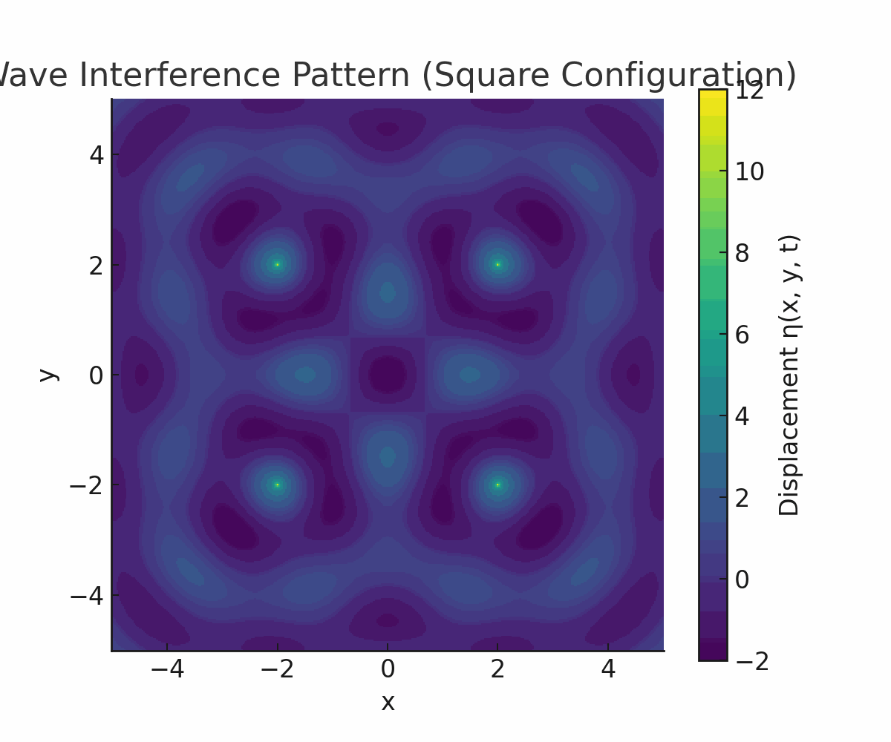

# Problem 1

# Interference Patterns from Point Wave Sources on a Water Surface

## Objective
To analyze the interference pattern formed by the superposition of circular waves emitted from point sources placed at the vertices of a **regular polygon** on the water surface.

## Motivation
Interference occurs when waves overlap, creating complex patterns that illustrate how waves interact. By placing point sources at the vertices of a regular polygon, we can observe and analyze the constructive and destructive interference patterns resulting from wave superposition.

---

## Selecting a Regular Polygon

We select a **square** (regular polygon with 4 equal sides and angles) as the configuration.

---

## Position the Sources

Let the side length of the square be `L`, and place the center of the square at the origin (0, 0). The coordinates of the four sources are:

- $(x_1, y_1) = (-L/2, -L/2)$
- $(x_2, y_2) = (L/2, -L/2)$
- $(x_3, y_3) = (L/2, L/2)$
- $(x_4, y_4) = (-L/2, L/2)$

---

## Wave Equations for Each Source

Each wave is described by:

$$
\eta_i(x, y, t) = \frac{A}{\sqrt{r_i}} \cdot \cos(kr_i - \omega t + \phi)
$$

Where:

- $r_i = \sqrt{(x - x_i)^2 + (y - y_i)^2}$
- $A$: Amplitude of the wave
- $k = \frac{2\pi}{\lambda}$: Wave number
- $\omega = 2\pi f$: Angular frequency
- $\phi$: Initial phase (assumed 0 for all sources for simplicity)

---

## Superposition of Waves

The total displacement at point $(x, y)$ is the sum:

$$
\eta_{\text{sum}}(x, y, t) = \sum_{i=1}^{4} \eta_i(x, y, t)
$$

---

## Analyzing Interference Patterns

### Constructive Interference
Occurs when the waves arrive in phase:

$$
kr_i - \omega t \approx kr_j - \omega t \quad \text{for } i \neq j
$$

This leads to **amplification**.

### Destructive Interference
Occurs when waves are out of phase by $$\pi$$:

$$
kr_i - \omega t \approx kr_j - \omega t + \pi
$$

This leads to **cancellation**.

---

## Visualization

The resulting pattern can be visualized using a 2D color map of $\eta_{\text{sum}}(x, y, t)$ at a fixed time. High-intensity regions represent constructive interference; dark regions represent destructive interference.

---

## Optional Parameters Used for Simulation

- Amplitude $A = 1$
- Wavelength $\lambda = 2$
- Frequency $f = 1$
- Phase $\phi = 0$
- Square side length $L = 4$
## Conclusion

By placing wave sources at the corners of a square and applying the principle of superposition, we can visualize intricate interference patterns. This exercise provides insight into the behavior of waves and how geometry influences interference on a water surface.

---

