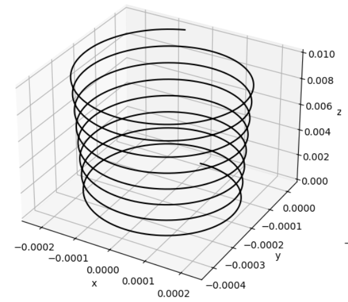
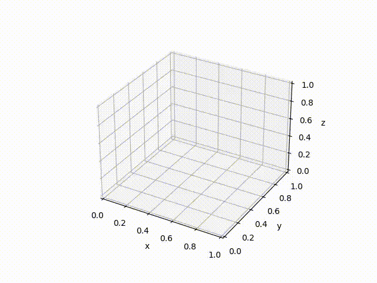
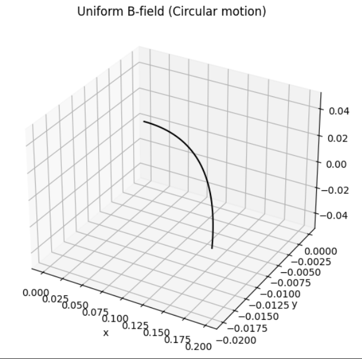
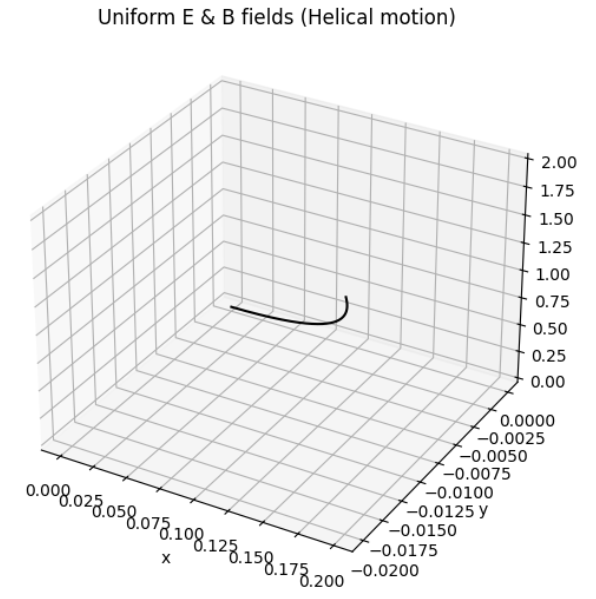
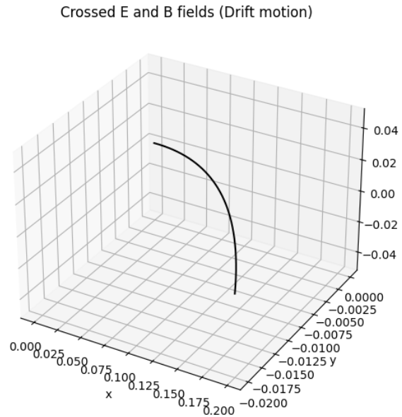
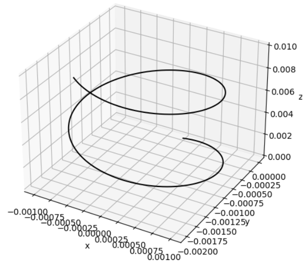
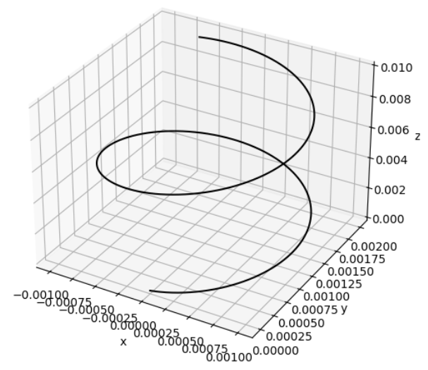

# Problem 1

## **1. Systems Where the Lorentz Force Plays a Key Role**

Below are several important systems and devices that critically depend on the Lorentz force:

---

### **A. Particle Accelerators**

- **Basic Principle**: Charged particles such as electrons or protons are boosted in energy using electric fields and guided using magnetic fields.
- **Function of Lorentz Force**:
  - $\vec{F} = q\vec{E}$: The electric field accelerates particles by increasing their speed.
  - $\vec{F} = q\vec{v} \times \vec{B}$: The magnetic component alters the particle's direction, often forcing it into circular or spiral paths.
- **Example**: In the Large Hadron Collider (LHC), extremely strong magnets direct high-speed protons along curved trajectories.

---

### **B. Mass Spectrometry**

- **Functionality**: Differentiates ions based on their ratio of mass to electric charge.
- **Role of Lorentz Force**:
  - As ions move through electric or magnetic fields, they are deflected depending on their charge and velocity.
  - The bending of their path reveals data about their mass.
- **Important Formula**: $$r = \frac{mv}{qB}$$
- **Uses**: Identifying unknown chemical substances and isotopes.

---

### **C. Plasma Control in Fusion Devices (Tokamaks)**

- **Operation**: Uses magnetic fields to enclose high-temperature plasma within a donut-shaped chamber.
- **Effect of Lorentz Force**:
  - Magnetic fields keep the ionized gas particles from contacting the reactor's inner walls.
- **Significance**: This containment is necessary for maintaining the conditions needed for nuclear fusion.

---

### **D. Cathode Ray Tubes (CRTs)**

- **Working Mechanism**: Beams of electrons are manipulated using fields to form images on a screen.
- **Lorentz Force Action**:
  - Electric fields speed up the electrons.
  - Magnetic fields adjust their direction to target different areas of the screen.

---

### **E. Astrophysical Interactions (e.g., Solar Wind and Magnetic Fields)**

- **Scenario**: Solar particles interact with magnetic fields of planets (like Earth).
- **Influence of Lorentz Force**:
  - Determines how charged cosmic particles move in space.
  - Responsible for phenomena such as auroras and geomagnetic storms.

---

## **2. Importance of Electric ($\vec{E}$) and Magnetic ($\vec{B}$) Fields**

---

### **Electric Fields ($\vec{E}$)**

- **Straight-line Acceleration**: Provide energy to particles by pushing them in the field’s direction.
- **Effect**: Modify the particle’s speed without necessarily altering its direction (in uniform fields).
- **Common Uses**:
  - Launching particles from rest.
  - Accelerating charged particles in a straight line.

---

### **Magnetic Fields ($\vec{B}$)**

- **Curving Paths**: Redirect particle motion without increasing speed.
- **Motion Type**: Cause particles to move in circles or spirals because the force acts at a right angle to the motion.
- **Applications**:
  - Directing and shaping beams in instruments.
  - Holding plasma in place inside reactors.

### Particle Moving in a Magnetic Field

---

### **Interaction of Both Fields**

The complete Lorentz force equation is:

$$\vec{F} = q\vec{E} + q\vec{v} \times \vec{B}$$

This enables complex particle behavior:

- **Cross-field Drift**: With perpendicular $\vec{E}$ and $\vec{B}$ fields, the particle drifts sideways to both.
- **Cyclotron Motion**: Pure magnetic field causes circular motion.
- **Helical Paths**: When both fields act together, the particle spirals along the magnetic field lines.

---

---

## Exploring Key Parameters

### **Lorentz Force Formula**

$$
\vec{F} = q (\vec{E} + \vec{v} \times \vec{B})
$$

Where:
- $q$: electric charge
- $m$: mass of the particle
- $\vec{E}$: electric field
- $\vec{B}$: magnetic field
- $\vec{v}$: particle’s velocity

---

### **1. Field Magnitudes: $\vec{E}$ and $\vec{B}$**

- **Electric Field ($\vec{E}$)**:
  - Acceleration from this field is: $\vec{a}_E = \frac{q\vec{E}}{m}$
  - This results in **linear motion** along the field direction.

- **Magnetic Field ($\vec{B}$)**:
  - Triggers **circular or spiral movement** if the velocity is not aligned with the field.
  - Radius of the circle: $r = \frac{mv}{|q||\vec{B}|}$
  - Frequency of rotation: $f = \frac{|q||\vec{B}|}{2\pi m}$

> **Observe**: 
- Larger $B$ compresses the spiral path.
- Stronger $E$ stretches the particle’s path along its field.

---

### **2. Initial Velocity $\vec{v}$**

- When $\vec{v} \parallel \vec{B}$: Particle proceeds in a straight line.
- When $\vec{v} \perp \vec{B}$: It moves in a circle.
- When $\vec{v}$ has both parallel and perpendicular parts: A helix forms.

> **Try Changing**: 
- Angle of $\vec{v}$ transitions motion type from straight to circular to spiral.

---

### **3. Charge $q$ and Mass $m$**

- **Charge ($q$)**:
  - The direction of force flips if the sign of $q$ changes.
  - A higher charge boosts the force.

- **Mass ($m$)**:
  - Influences acceleration (more mass = more inertia).
  - Heavier particles move in wider circles and respond slower.

> **Investigate**: 
- Compare motion of particles with opposite charge signs.
- See how heavier particles rotate more sluggishly and broadly.

---

### Charged Particle Motion Under Electric and Magnetic Influence

---

## Understanding the Larmor Radius and Drift Velocity

---

## **1. Larmor (Cyclotron) Radius**

This radius describes how far a particle curves when it moves at a right angle to a magnetic field.

### Formula:

$$
r_L = \frac{mv}{|q|B}
$$

- $m$: mass of the particle  
- $v$: speed perpendicular to the magnetic field  
- $q$: electric charge  
- $B$: magnetic field strength

### Interpretation:
- **Higher $B$** → Tighter curve.
- **Larger $m$ or $v$** → Wider curve.
- Indicates the **size of the circular/spiral motion** in a magnetic field.

---

## **2. Drift Velocity**

Charged particles also move with a **drift velocity** when exposed to both electric and magnetic fields, especially in plasmas or conducting materials.

### Formula:

$$
\vec{v}_D = \frac{\vec{E}}{B}
$$

- $\vec{E}$: electric field vector  
- $B$: magnetic field magnitude

### Meaning:
- Drift occurs at a right angle to both fields.
- In **crossed-field** conditions, the spiral path slowly shifts in the electric field’s direction.

---

## **Combining Larmor Radius and Drift**

- In mixed fields, the motion becomes a **helix**:
  - Circle radius = Larmor radius.
  - Entire spiral shifts due to drift velocity.

[My Colab](https://colab.research.google.com/drive/1kRbcIlwZqqzgTBV7xmFVvQortWoUYEs4?usp=sharing)
