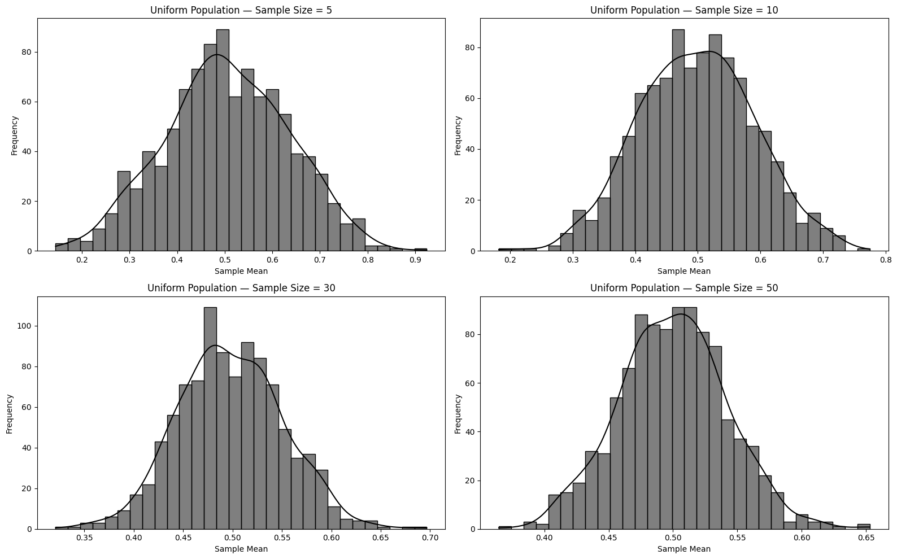
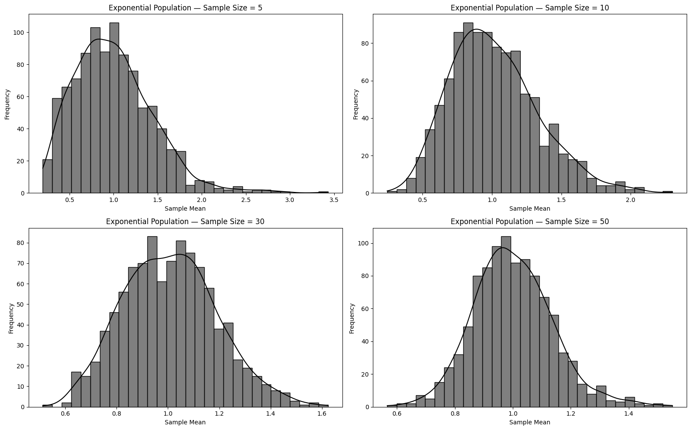
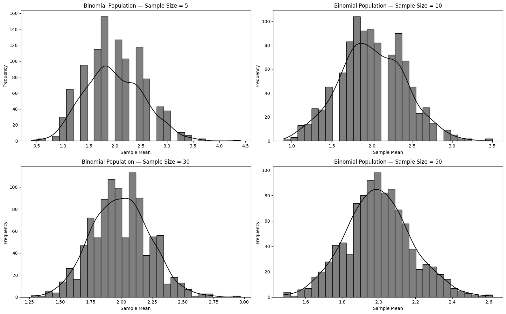

# Problem 1

### Simulating Population Distributions

This approach enables us to observe how the sampling distribution of the mean increasingly resembles a normal distribution as sample size grows — a key concept behind the **Central Limit Theorem**.

---

---

---

## Parameter Exploration

### 1. **Rate of Convergence to Normality**
   
   Different population shapes (Uniform, Exponential, Binomial) require varying sample sizes before their sampling distributions resemble a normal distribution.

   We will employ visual tools (histograms, Q-Q plots) and statistical tests to analyze this.

### 2. **Variance and Dispersion**
   
   The spread (standard deviation) of the sampling distribution diminishes as the sample size increases.

   Theoretically, $\sigma_{\bar{x}} = \frac{\sigma}{\sqrt{n}}$, where $\sigma$ is the population's standard deviation.

   We will empirically compare this theoretical formula with the observed dispersion of sample means.

## Real-World Applications

The Central Limit Theorem (CLT) isn't just theoretical — it has widespread practical relevance:

### 1. **Estimating Population Characteristics:**

   In surveys or polls, it's often unfeasible to collect data from an entire population.

   By drawing random samples, the CLT ensures that the sample average is a dependable estimate of the population mean.

   This supports the use of confidence intervals and hypothesis testing.

### 2. **Manufacturing and Quality Control:**
   
   Factories track product quality by sampling items from production lines.

   The CLT ensures that sample averages reflect the broader process, even when individual measurements fluctuate.

   This aids in identifying defects or anomalies early without inspecting every item.

### 3. **Finance and Risk Modeling:**
   
   Financial professionals assess asset returns and portfolio risk using averages of returns.

   The CLT makes it possible to model these aggregate returns as approximately normal, even if the individual returns are skewed or irregular.

   This enables tools like Value at Risk (VaR) and portfolio optimization.

In each of these areas, the CLT provides a mathematical basis for making conclusions about large groups or systems using manageable samples.

---

[Google Colab](https://colab.research.google.com/drive/1OYUPMbmXrXpP1u9pxJ4wsWCXWQaEdV2P?usp=sharing)
