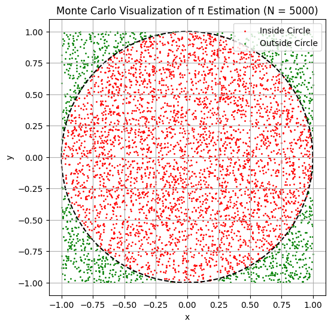
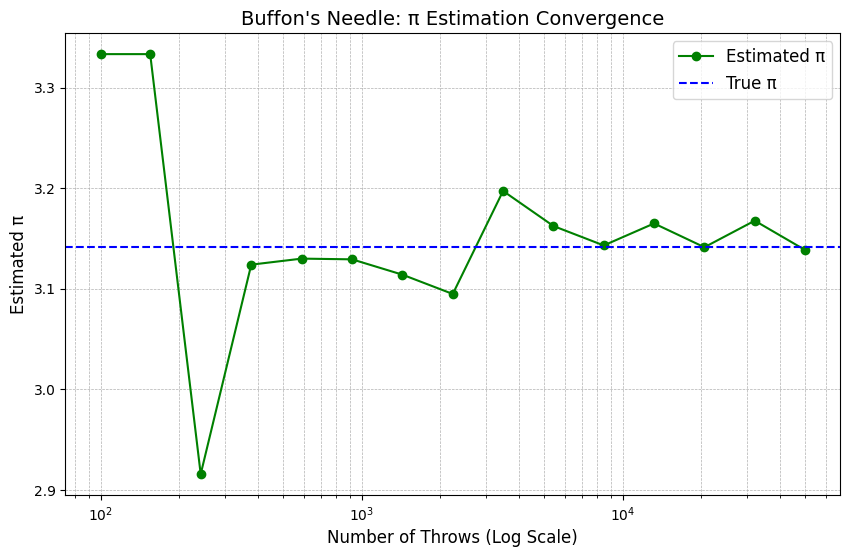

# Problem 2

# Determining π Using Monte Carlo Techniques  
---

## Theoretical Background

To calculate π through randomness, we utilize a setup based on geometric probabilities.

- Construct a **square** with a side length of 2, centered at the origin. This square spans from $-1$ to $1$ along both the x and y axes.
- Enclose a **unit circle** (radius $r = 1$) inside this square, also centered at the origin.

We then generate random points $(x, y)$, where $x, y \in [-1, 1]$, ensuring they are uniformly spread across the square.

### Areas of Interest:

- **Square Area**:  
$$A_{\text{square}} = 2 \times 2 = 4$$

- **Circle Area**:  
$$A_{\text{circle}} = \pi \times r^2 = \pi \times 1^2 = \pi$$

The **likelihood** that a randomly chosen point lands **inside the circle** is expressed as the ratio of their areas:

$$
P(\text{inside circle}) = \frac{A_{\text{circle}}}{A_{\text{square}}} = \frac{\pi}{4}
$$

Thus, by generating a large number of random points and tallying those that fall within the circle, we can expect:

$$
\frac{\text{Points inside circle}}{\text{Total points}} \approx \frac{\pi}{4}
$$

---

## Deriving the Estimation Formula

From the theoretical relationship:

$$
\frac{\text{Points inside circle}}{\text{Total points}} \approx \frac{\pi}{4}
$$

We rearrange to estimate π:

$$
\pi \approx 4 \times \frac{\text{Points inside circle}}{\text{Total points}}
$$

This is the key formula for **Monte Carlo π estimation**.

---

## Determining If a Point Is Within the Circle

For any randomly chosen point $(x, y)$, it is **inside the unit circle** if:

$$
x^2 + y^2 \leq 1
$$

Hence, for each generated point, calculate $x^2 + y^2$.  
If the result is less than or equal to 1, the point is considered **inside the circle**.

---

## Steps for Monte Carlo Simulation to Approximate π

The simulation proceeds as follows:

1. Generate $N$ random points $(x, y)$ within the square defined by $[-1, 1] \times [-1, 1]$.
2. Count how many of these points lie within the circle using the condition $x^2 + y^2 \leq 1$.
3. Estimate π using the formula:

$$
\pi \approx 4 \times \frac{\text{Points inside circle}}{\text{Total points}}
$$

---

## Visualizing Monte Carlo Points

To better understand the Monte Carlo approach for approximating π:

- Plot all the randomly generated points $(x, y)$ inside the square.
- Mark points **inside** the circle ($x^2 + y^2 \leq 1$) in **blue**.
- Mark points **outside** the circle in **red**.
- Display the unit circle inscribed within a square of side 2, centered at the origin.

This visualization provides an intuitive understanding of how the ratio of areas is linked to π.

---

## Convergence and Accuracy Analysis

Monte Carlo methods rely on statistical principles, improving in precision as the sample size increases. Here’s what we do:

- Conduct simulations with progressively larger numbers of random points $N$.
- Observe how the approximation of π converges over iterations.
- Study the **rate of convergence** and **computational factors**.

---

### Behavior of Convergence

Let $E(N)$ represent the estimated value of π after generating $N$ random points. By the **Law of Large Numbers**, we anticipate:

$$
\lim_{N \to \infty} E(N) = \pi
$$

The standard error (typical deviation from the true value) reduces as:

$$
\text{Error} \propto \frac{1}{\sqrt{N}}
$$

This implies that reducing the error by a factor of 10 requires increasing the number of points by 100 times.

---

### Considerations for Computation

- **Advantages**:
  - Straightforward and simple to implement.
  - Can efficiently utilize parallel computing.
  - Works well even for complex geometric regions.

- **Disadvantages**:
  - Convergence rate is slow ($\mathcal{O}(1/\sqrt{N})$).
  - Requires a very large number of samples for high accuracy (e.g., millions of points).

---

### Simulation: Visualizing Convergence

We simulate π approximation for a series of $N$ values and chart the outcomes to observe convergence behavior.

---

# Estimating π via Buffon’s Needle  
## Conceptual Framework

---

### Buffon’s Needle Problem

The Buffon’s Needle problem is a classic **geometric probability** challenge, introduced by French mathematician **Georges-Louis Leclerc, Comte de Buffon** in the 18th century.

The scenario is:

- A floor is marked with **equally spaced parallel lines**, separated by a distance $d$.
- A needle of length $\ell$ is **randomly dropped** onto the floor.
- The task is to compute the **likelihood** of the needle **intersecting** one of the lines.

Interestingly, this probability involves **π**, allowing us to estimate its value.

---

### Conditions

- The needle length $\ell$ must satisfy $\ell \leq d$.
- The needle is dropped with a **random position and orientation**.
- Define:
  - $N$ = total needle drops.
  - $C$ = occurrences where the needle crosses a line.

---

### Deriving the Probability

Let:

- $\theta$ represent the acute angle between the needle and the lines, distributed uniformly within $[0, \frac{\pi}{2}]$.
- $x$ denote the shortest distance from the center of the needle to the closest line, uniformly in $[0, \frac{d}{2}]$.

The needle crosses a line if **half the needle projects beyond the nearest line**, i.e.:

$$
x \leq \frac{\ell}{2} \sin\theta
$$

The likelihood of this event (over all possible $(x, \theta)$ pairs) is calculated as:

$$
P(\text{cross}) = \frac{2\ell}{\pi d}
$$

---

### Estimating π Experimentally

If we perform $N$ trials and record $C$ crossings, the empirical probability aligns with the theoretical one:

$$
\frac{C}{N} \approx \frac{2\ell}{\pi d}
$$

Rearranging to solve for π:

$$
\pi \approx \frac{2\ell N}{dC}
$$

---

### Final Formula for π Approximation

Let:

- $\ell$ = length of the needle.
- $d$ = spacing between lines.
- $N$ = number of needle drops.
- $C$ = number of crossings observed.

Then:

$$
\boxed{
\pi \approx \frac{2 \cdot \ell \cdot N}{d \cdot C}
}
$$

---

This technique is a profound example of geometric probability and an alternate Monte Carlo approach to π approximation.

[Google Colab]https://colab.research.google.com/drive/1WMf30zKV3_y9dT4nBBhb_v9ZlXLugmco?usp=sharing)
